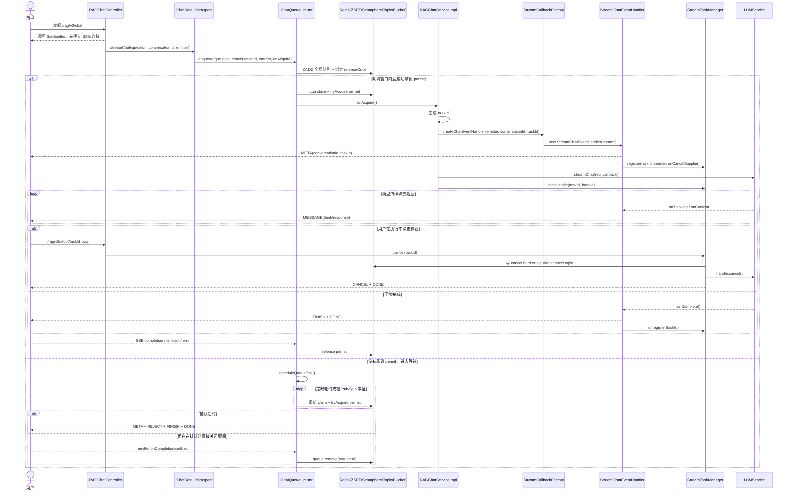

# 简历亮点五：Redis 分布式排队限流 + SSE 流式结果回传

## 一、简历原文

> 基于 Redis ZSET + Lua 脚本实现分布式排队限流，配合可过期信号量与 Pub/Sub 跨节点唤醒，通过 SSE 回传执行结果与拒绝/取消状态，有效防止高并发下大模型服务穿透

**实现精度说明：**

当前代码并不会在排队等待阶段持续推送“排队中”或队列位置。SSE 主要承担三类职责：

1. 请求真正开始执行后，持续回传流式内容
2. 排队超时后，明确返回 `reject`
3. 执行中取消后，明确返回 `cancel`

## 二、业务背景

大模型调用有两个核心特征：**贵**（按 token 计费）和**慢**（流式响应可能持续几十秒）。在高并发场景下，如果不做限流，会出现：

1. **模型服务穿透**：同时几十个请求打到大模型 API，超出 QPM/并发限制直接报错，所有用户都失败
2. **资源耗尽**：每个流式请求占一条线程和 HTTP 连接，无上限接入会导致线程池打满
3. **用户体验差**：请求被模型 API 拒绝后，用户只看到一个"系统错误"，不知道发生了什么

因此需要一个**分布式排队限流系统**：
- **排队**：超出并发上限的请求排队等待，不直接拒绝
- **限流**：用信号量严格控制同时调用大模型的请求数
- **分布式**：多个后端节点共享队列和限流状态
- **明确反馈**：通过 SSE 在开始执行后回传流式内容，并在超时/取消时给出明确结果

## 三、整体流程

```
用户发起聊天请求（SSE 长连接）
  │
  ▼
Controller 返回 SseEmitter（timeout=0，永不超时）
  │
  ▼
AOP 切面 @ChatRateLimit 拦截
  │  ChatRateLimitAspect.limitStreamChat()
  │  提取 question, conversationId, emitter
  │  将真正的方法执行包装成 Runnable onAcquire
  │  → 调用 chatQueueLimiter.enqueue()
  │  → 立即返回 null（SSE 异步推送）
  ▼
ChatQueueLimiter.enqueue()
  │
  ├── 【开关检查】限流关闭？
  │     → 直接在 chatEntryExecutor 上执行 onAcquire
  │
  ├── 【Step 1：入队】
  │     requestId = 雪花 ID
  │     seq = Redis RAtomicLong 全局递增序号
  │     ZADD rag:global:chat:queue seq requestId
  │     注册 emitter 回调（onCompletion/onTimeout/onError → releaseOnce）
  │
  ├── 【Step 2：快速路径尝试】
  │     tryAcquireIfReady()
  │     → availablePermits() 检查信号量剩余
  │     → claimIfReady() 执行 Lua 脚本原子 claim
  │     → tryAcquirePermit() 获取可过期信号量 permit
  │     → 成功？→ 执行 onAcquire，结束
  │
  └── 【Step 3：排队轮询】（快速路径失败时）
        scheduleQueuePoll()
        │
        │  scheduler.scheduleAtFixedRate(poller, 200ms)
        │  同时 pollNotifier.register(requestId, poller)
        │
        │  每次 poller 执行：
        │  ├── cancelled? → 注销 + 停止
        │  ├── 超过 deadline? → 出队 + sendRejectEvents() + 停止
        │  └── tryAcquireIfReady() 成功? → 注销 + 执行 onAcquire + 停止
        │
        │  跨节点唤醒：
        │  其他节点释放 permit → publish("permit_released")
        │  → 本节点 PollNotifier.fire()
        │  → 立即触发所有注册的 poller 重试
        │
        ▼
      最终结果：
        成功获取 permit → META → MESSAGE（流式内容） → FINISH → DONE
        排队超时        → META → REJECT（"系统繁忙"） → FINISH → DONE
        执行中用户取消  → META → MESSAGE（部分） → CANCEL → DONE
```

**说明：**

1. 排队中的请求还没有 `taskId`，因此也不会先发 `META`
2. `META` 是真正进入 `RAGChatServiceImpl.streamChat()`，创建 `StreamChatEventHandler` 后才会发送
3. 排队阶段如果用户直接关闭页面，主要走 `SseEmitter` 的生命周期回调做清理，不会走 `stop(taskId)` 路径

### 3.1 Lua 原子 Claim 流程

```
claimIfReady() 调用 Lua 脚本
  │
  │  KEYS[1] = rag:global:chat:queue（ZSET）
  │  ARGV[1] = requestId
  │  ARGV[2] = availablePermits（可用许可数）
  │
  ▼
  ZRANK queueKey requestId  →  获取排名
  │
  ├── rank == nil          →  不在队列中    → return {0}
  ├── rank >= maxRank      →  不在队头窗口  → return {0}
  └── rank < maxRank       →  在窗口内！
        ZSCORE queueKey requestId  →  保存原始分数
        ZREM queueKey requestId    →  出队
        return {1, score}          →  claim 成功
```

**为什么需要 Lua？** 如果 ZRANK 和 ZREM 分成两条命令，两个节点可能同时看到 rank=0，同时 ZREM，导致一个 permit 被两个请求争抢。Lua 脚本在 Redis 单线程中原子执行，不存在竞态。

### 3.2 核心组件关系

```
RAGChatController
  └── SseEmitter（SSE 长连接入口）

ChatRateLimitAspect（AOP 切面）
  └── ChatQueueLimiter（排队限流核心，534 行）
        ├── Redis ZSET（排队队列）
        ├── Lua Script（原子 claim）
        ├── RPermitExpirableSemaphore（可过期信号量）
        ├── RTopic / Pub/Sub（跨节点唤醒）
        ├── PollNotifier（事件驱动通知器）
        └── SseEmitterSender（线程安全 SSE 发送）

StreamTaskManager（流式任务管理 + 跨节点取消）
  ├── Guava Cache（本地任务注册表）
  ├── RTopic（取消信号广播）
  └── RBucket（取消标记持久化）
```

### 3.3 完整时序图



**时序图里最容易被问到的两个点：**

1. `taskId` 不是入队时生成的，而是**真正开始执行 `streamChat()` 之后**才生成
2. 排队阶段如果用户关闭页面，没有 `taskId`，因此不会走 `/stop`，而是直接走 `releaseOnce` 清理队列

---

## 四、核心组件详解

### 4.1 ChatQueueLimiter（排队限流主体）

`ChatQueueLimiter.java`，534 行，项目中最复杂的单个类。

**Redis 资源清单：**

| Key | 类型 | 用途 |
|-----|------|------|
| `rag:global:chat:queue` | ZSET | 排队队列，score=序号，member=requestId |
| `rag:global:chat:queue:seq` | AtomicLong | 全局递增序号生成器 |
| `rag:global:chat` | PermitExpirableSemaphore | 可过期信号量，控制并发上限 |
| `rag:global:chat:queue:notify` | Topic(Pub/Sub) | permit 释放通知 |

**入队方法 `enqueue()`（第 111-143 行）：**

```java
public void enqueue(String question, String conversationId, SseEmitter emitter, Runnable onAcquire) {
    // 1. 限流关闭 → 直接执行
    if (!Boolean.TRUE.equals(rateLimitProperties.getGlobalEnabled())) {
        chatEntryExecutor.execute(onAcquire);
        return;
    }

    // 2. 生成请求 ID，加入 ZSET 队列
    String requestId = IdUtil.getSnowflakeNextIdStr();
    RScoredSortedSet<String> queue = redissonClient.getScoredSortedSet(QUEUE_KEY);
    long seq = nextQueueSeq();       // Redis RAtomicLong 全局递增
    queue.add(seq, requestId);        // ZADD

    // 3. 注册 SSE 生命周期回调（释放资源）
    Runnable releaseOnce = () -> {
        cancelled.set(true);
        queue.remove(requestId);
        String permitId = permitRef.getAndSet(null);
        if (permitId != null) {
            semaphore.release(permitId);
            publishQueueNotify();     // 通知其他节点
        }
    };
    emitter.onCompletion(releaseOnce);
    emitter.onTimeout(releaseOnce);
    emitter.onError(e -> releaseOnce.run());

    // 4. 快速路径尝试
    if (tryAcquireIfReady(queue, requestId, permitRef, cancelled, onAcquire)) {
        return;
    }

    // 5. 快速路径失败 → 排队轮询
    scheduleQueuePoll(...);
}
```

**快速路径 `tryAcquireIfReady()`（第 195-237 行）：**

三步操作，每步都可能失败并优雅降级：

```java
// Step A: 检查信号量是否有空余
int availablePermits = availablePermits();
if (availablePermits <= 0) return false;

// Step B: Lua 脚本原子 claim（检查排名 + 出队）
ClaimResult claimResult = claimIfReady(queue, requestId, availablePermits);
if (!claimResult.claimed) return false;

// Step C: 获取可过期信号量 permit
String permitId = tryAcquirePermit();
if (permitId == null) {
    // claim 成功但 permit 被抢走 → 重新入队
    queue.add(nextQueueSeq(), requestId);
    publishQueueNotify();
    return false;
}

// 全部成功 → 执行业务逻辑
permitRef.set(permitId);
chatEntryExecutor.execute(() -> runOnAcquire(onAcquire));
```

**关键设计：claim 成功但 permit 获取失败的处理。** Lua claim 和信号量获取不是原子操作。两个请求可能同时通过 Lua claim（因为两次 claim 看到的 `availablePermits` 可能一样），但只有一个能拿到 permit。失败的那个需要**重新入队**（用新的 seq 排到队尾），而不是直接丢弃。

### 4.2 Lua 原子 Claim 脚本

`lua/queue_claim_atomic.lua`，23 行：

```lua
local queueKey = KEYS[1]
local requestId = ARGV[1]
local maxRank = tonumber(ARGV[2])

-- 获取排名
local rank = redis.call('ZRANK', queueKey, requestId)
if not rank then return {0} end      -- 不在队列中
if rank >= maxRank then return {0} end  -- 不在队头窗口

-- 保存分数（用于可能的重入队）+ 出队
local score = redis.call('ZSCORE', queueKey, requestId)
redis.call('ZREM', queueKey, requestId)
return {1, score}
```

**"队头窗口"概念：** 假设信号量有 3 个可用 permit，那 `maxRank=3`，只有排名 0、1、2 的请求有资格 claim。排名 3 及以后的请求不管信号量有没有余量，都要继续等。这保证了**公平性**——先来的请求先获得执行权。

### 4.3 可过期信号量（RPermitExpirableSemaphore）

`ChatQueueLimiter.java` 第 239-249 行：

```java
private String tryAcquirePermit() {
    RPermitExpirableSemaphore semaphore =
        redissonClient.getPermitExpirableSemaphore(SEMAPHORE_NAME);
    semaphore.trySetPermits(rateLimitProperties.getGlobalMaxConcurrent());
    return semaphore.tryAcquire(
        0,                                          // 不等待，立即返回
        rateLimitProperties.getGlobalLeaseSeconds(), // lease 过期时间（默认 600 秒）
        TimeUnit.SECONDS
    );
}
```

**为什么用"可过期"信号量？**

普通信号量（`RSemaphore`）的 `acquire` 返回 `void`，如果持有 permit 的节点 JVM 崩溃了，permit 永远无法归还——信号量会被"吃掉"一个，直到最终所有 permit 都泄漏，系统完全卡死。

`RPermitExpirableSemaphore` 的 `tryAcquire` 返回一个 `permitId`（字符串），每个 permit 有独立的 lease 过期时间。如果节点崩溃：
- permit 到期后 Redis 自动回收（默认 600 秒）
- 不需要任何看门狗或补偿机制
- 其他节点的请求不受影响

**release 必须带 permitId：**

```java
semaphore.release(permitId);  // 精确释放特定的 permit
```

不是释放"一个"permit，而是释放"这个"permit。防止一个请求释放两次。

### 4.4 Pub/Sub 跨节点唤醒

**问题：** 节点 A 释放了一个 permit，但排队的请求可能在节点 B 上。如果只靠轮询（200ms 一次），延迟白白增加 0~200ms。

**解法：** 每次 permit 释放后 publish 通知，其他节点立刻触发 poller 重试。

**订阅（启动时，第 99-109 行）：**

```java
@PostConstruct
public void subscribeQueueNotify() {
    pollNotifier = new PollNotifier(this::availablePermits);
    pollNotifier.startCleanup();
    RTopic topic = redissonClient.getTopic(NOTIFY_TOPIC);
    notifyListenerId = topic.addListener(String.class, (channel, msg) -> {
        pollNotifier.fire();  // 唤醒所有注册的 poller
    });
}
```

**发布（permit 释放时，第 308-310 行）：**

```java
private void publishQueueNotify() {
    redissonClient.getTopic(NOTIFY_TOPIC).publish("permit_released");
}
```

这个方法在以下场景被调用：
- permit 释放后（`releaseOnce` 和 `releasePermit`）
- 队列移除后（超时出队）
- claim 成功后（通知其他排队的请求更新排名）
- 重入队后（claim 成功但 permit 失败）

### 4.5 PollNotifier 事件驱动通知器

`ChatQueueLimiter.java` 第 443-532 行，内部静态类。

**为什么不直接在 Pub/Sub 回调里跑 poller？**

Pub/Sub 回调运行在 Redisson 的 Netty IO 线程上，如果在里面做 Redis 调用（Lua 脚本、信号量操作），会阻塞 Netty 线程，导致整个 Redis 连接阻塞。`PollNotifier` 把通知转发到独立线程池执行。

**通知合并机制（第 483-502 行）：**

```java
void fire() {
    pendingNotifications.incrementAndGet();
    if (!firing.compareAndSet(false, true)) {
        return;  // 已经有人在 fire，合并通知
    }
    notifyExecutor.execute(() -> {
        do {
            pendingNotifications.set(0);
            if (permitSupplier.getAsInt() <= 0) continue;
            for (PollerEntry entry : pollers.values()) {
                entry.poller().run();
            }
        } while (pendingNotifications.get() > 0
                 && firing.compareAndSet(false, true));
    });
}
```

短时间内多个 permit 释放时，不会触发 N 次 poller 遍历，而是合并成一次。`do-while + CAS` 保证不会丢失通知：如果在遍历过程中又有新通知到达，会再跑一轮。

**过期清理（第 524-531 行）：**

每分钟清理注册超过 5 分钟的 poller（对应请求早已超时但 poller 没被正确注销的异常情况），防止内存泄漏。

### 4.6 StreamTaskManager 跨节点取消

`StreamTaskManager.java`，183 行。

**取消流程：**

```
用户点击"停止生成"
  → POST /rag/v3/stop?taskId=xxx
  → StreamTaskManager.cancel(taskId)
  │
  ├── Redis RBucket 写入取消标记（30 分钟 TTL）
  │     ragent:stream:cancel:{taskId} = true
  │
  └── Redis RTopic 广播取消信号
        ragent:stream:cancel → publish(taskId)
        │
        ├── 节点 A 收到 → cancelLocal(taskId)
        ├── 节点 B 收到 → cancelLocal(taskId)
        └── ...

cancelLocal(taskId):
  1. CAS compareAndSet(false, true) → 保证只执行一次
  2. handle.cancel() → 取消底层 OkHttp Call
  3. sender.sendEvent(CANCEL, payload)
  4. sender.sendEvent(DONE, "[DONE]")
  5. sender.complete()
```

**为什么同时用 RBucket + RTopic？**
- RTopic 是瞬时消息，发出后就没了——如果取消请求到达时任务还没注册（注册延迟），Pub/Sub 消息会丢失
- RBucket 是持久化标记（30 分钟 TTL），任务注册时会检查 `isTaskCancelledInRedis()`，发现已经被取消就立刻发 CANCEL 事件

### 4.7 SSE 事件协议

6 种事件类型，与前端约定一致：

| 事件 | 触发时机 | 数据 |
|------|---------|------|
| `meta` | 流开始 | `{conversationId, taskId}` |
| `message` | 内容到达 | `{type:"response"/"think", content:"..."}` |
| `finish` | 生成完成 | `{messageId, title}` |
| `done` | 连接终止 | `"[DONE]"` |
| `cancel` | 用户取消 | `{messageId, title}` |
| `reject` | 排队超时 | `{type:"response", content:"系统繁忙，请稍后再试"}` |

**SseEmitterSender 线程安全保证：**

```java
private final AtomicBoolean closed = new AtomicBoolean(false);

public void complete() {
    if (closed.compareAndSet(false, true)) {  // CAS 保证只关一次
        emitter.complete();
    }
}
```

SSE 连接可能被多个线程同时关闭（业务完成 + 超时回调 + 错误回调），CAS 保证 `complete()` 只执行一次。

### 4.8 配置参数

`RAGRateLimitProperties.java`：

| 参数 | 默认值 | YAML 覆盖值 | 说明 |
|------|--------|------------|------|
| `globalEnabled` | true | true | 限流总开关 |
| `globalMaxConcurrent` | 50 | 1 | 最大并发数（开发环境设为 1 方便测试） |
| `globalMaxWaitSeconds` | 20 | 3 | 排队最大等待秒数 |
| `globalLeaseSeconds` | 600 | 30 | permit 自动过期时间 |
| `globalPollIntervalMs` | 200 | 200 | 轮询间隔 |

---

## 五、疑问与解答记录

### Q1：为什么用 Redis ZSET 做排队，而不用 Redis List（LPUSH/RPOP）？

**正确答案：**

ZSET 的两个核心优势：
1. **公平性判断**：`ZRANK` 可以在 O(log N) 内获取任意元素的排名，用于判断"是否在队头窗口内"。List 做不到——你只能 POP 头部元素，不能查"这个元素排第几"
2. **安全出队**：ZSET 中每个 member 是唯一的，`ZREM` 精确删除特定请求。List 中相同值的元素可能被误删

List 更适合"严格按顺序消费"的场景，而这里需要"检查排名 → 条件出队"的两步原子操作，ZSET + Lua 是最合适的选择。

### Q2：Lua 脚本为什么需要？ZRANK 和 ZREM 分开执行不行吗？

**正确答案：**

不行，会有竞态条件：

```
时间点 T1: 节点 A 执行 ZRANK("req-A") → 返回 0（排名第一）
时间点 T2: 节点 B 执行 ZRANK("req-B") → 返回 1（排名第二）
时间点 T3: availablePermits = 2，两个都在窗口内
时间点 T4: 节点 A 执行 ZREM("req-A") → 成功
时间点 T5: 节点 B 执行 ZREM("req-B") → 成功
```

两个请求都 claim 成功，但可能只有一个 permit。Lua 脚本在 Redis 单线程中原子执行 ZRANK+ZREM，不存在这个问题。

### Q3：什么叫"可过期信号量"？和普通信号量有什么区别？

**正确答案：**

| 维度 | RSemaphore | RPermitExpirableSemaphore |
|------|-----------|--------------------------|
| acquire 返回值 | void | **permitId（字符串）** |
| release 方式 | `release()` 归还一个 | `release(permitId)` 精确归还 |
| 节点崩溃 | **permit 永久丢失** | **lease 到期自动回收** |
| 重复释放 | 可能导致超额 | permitId 已释放则忽略 |

核心差异：可过期信号量的每个 permit 有独立的 TTL。节点崩溃后，等 lease 过期（默认 600 秒），Redis 自动回收 permit，不需要人工干预。

### Q4：Pub/Sub 跨节点唤醒的延迟是多少？和纯轮询相比有什么好处？

**正确答案：**

Pub/Sub 消息传播延迟通常 **< 1ms**（同机房 Redis）。

对比：
- **纯轮询（200ms 间隔）**：平均延迟 100ms（0~200ms 均匀分布），CPU 空跑浪费
- **Pub/Sub 事件驱动**：接近 0 延迟，permit 释放后几乎立刻唤醒排队的 poller

实际设计是**双重保险**：Pub/Sub 做主要唤醒，200ms 轮询做兜底（防止 Pub/Sub 消息丢失）。

### Q5：PollNotifier 的 `fire()` 方法为什么用 do-while + CAS？

**正确答案：**

解决"通知合并"和"不丢通知"的矛盾：

```java
pendingNotifications.incrementAndGet();     // 记录有新通知
if (!firing.compareAndSet(false, true)) {
    return;                                  // 已有线程在 fire，合并到它里面
}
// 在独立线程中执行：
do {
    pendingNotifications.set(0);             // 清零
    // ... 遍历所有 poller ...
} while (pendingNotifications.get() > 0     // 遍历期间又来了新通知
         && firing.compareAndSet(false, true)); // 再跑一轮
```

如果不用 do-while，可能出现：线程 A 遍历到一半时线程 B 发了新通知，但 A 遍历完就结束了，B 的通知被吞掉。do-while 确保最后一轮遍历时如果又有新通知就再跑一轮。

### Q6：请求 claim 成功但 permit 获取失败怎么办？

**正确答案：**

这是一个**关键边界情况**。代码中处理如下（第 211-216 行）：

```java
String permitId = tryAcquirePermit();
if (permitId == null) {
    long newSeq = nextQueueSeq();
    queue.add(newSeq, requestId);    // 重新入队，新序号排到队尾
    publishQueueNotify();            // 通知其他请求
    return false;
}
```

原因：Lua claim 和信号量 acquire 不是原子的。两个请求可能同时 claim 成功（Lua 脚本分别执行时看到的 `availablePermits` 可能相同），但只有一个能拿到最后一个 permit。

**重新入队用新序号**（排到队尾），不是用原始序号，因为 ZSET 的 score 必须唯一映射到排名位置，用旧序号可能和新请求冲突。

### Q7：SSE 连接的 onCompletion/onTimeout/onError 回调中的 `releaseOnce` 为什么用 AtomicReference + getAndSet？

**正确答案：**

```java
Runnable releaseOnce = () -> {
    cancelled.set(true);
    queue.remove(requestId);
    String permitId = permitRef.getAndSet(null);  // 原子地取出并置空
    if (permitId != null) {
        semaphore.release(permitId);
        publishQueueNotify();
    }
};
```

`getAndSet(null)` 保证 **exactly-once 释放**：
- 多个回调可能同时触发（连接完成 + 超时 + 错误可能时间重叠）
- 第一个执行的拿到 permitId 并置空
- 后续执行的拿到 null，不做任何操作
- 防止同一个 permit 被 release 两次

### Q8：排队超时后，用户的问题和"系统繁忙"回复会被记录吗？

**正确答案：** 会。`recordRejectedConversation()`（第 312-339 行）做了以下事情：

1. 调用 `memoryService.append()` 保存用户问题
2. 调用 `memoryService.append()` 保存"系统繁忙，请稍后再试"作为 assistant 回复
3. 如果是新会话，生成会话标题

这样用户刷新页面后，能在聊天记录中看到之前的问题和"系统繁忙"的回复，而不是一片空白。

### Q9：`StreamTaskManager` 为什么同时用 RTopic 和 RBucket？

**正确答案：**

解决**取消信号与任务注册的时序竞争**：

```
场景：用户极快地发送 → 取消
  T1: 请求到达，开始排队（taskId 还没注册到 StreamTaskManager）
  T2: 用户点击取消 → RTopic.publish(taskId)
  T3: StreamTaskManager 收到取消信号 → tasks.get(taskId) == null → 无法取消！
  T4: 任务获得 permit，注册到 StreamTaskManager → 开始执行，但用户已经不想要了
```

RBucket 解决了这个问题：
- T2 不仅 publish，还在 Redis 中写入 `ragent:stream:cancel:{taskId} = true`（30 分钟 TTL）
- T4 注册时调用 `isTaskCancelledInRedis(taskId)` 检查这个 key → 发现已取消 → 立刻发 CANCEL 事件

### Q10：AOP 切面为什么用反射 `method.invoke()` 而不是 `joinPoint.proceed()`？

**正确答案：**

因为 `onAcquire` 回调是**异步执行**的。`joinPoint.proceed()` 只能在 AOP 的 `@Around` 方法栈内调用，一旦 `limitStreamChat()` 返回，`joinPoint` 就失效了。

而 `chatQueueLimiter.enqueue()` 的 `onAcquire` 回调可能在几秒甚至几十秒后才被执行（排队等待期间），此时必须用反射 `method.invoke(target, args)` 直接调用原始方法。

### Q11：如果 Redis 挂了，整个限流系统会怎样？

**正确答案：**

当前实现**不会自动降级为无限流模式**。

如果 `globalEnabled=true` 且 Redis 在运行期间不可用，那么 `enqueue()` 里的 Redis 操作（ZADD、Lua eval、信号量 acquire、Topic publish）都会失败，限流链路本身就无法正常工作。

更准确地说，可能出现三种情况：

1. **新进来的请求**：会因为 Redis 调用异常而无法正常进入排队限流流程
2. **已经在执行中的请求**：模型调用本身通常还能继续跑，但 permit 释放、取消广播这类 Redis 协调动作可能失败
3. **已经在排队中的请求**：轮询和唤醒都依赖 Redis，当前实现下无法继续按既有机制推进

如果想恢复，只能：

1. Redis 恢复
2. 或者人工关闭限流开关 `globalEnabled=false`，让请求绕过这套排队限流逻辑

这也是当前方案的一个明确边界。后续如果要增强健壮性，可以补本地降级模式，比如 Redis 不可用时切到进程内 `Semaphore` 或直接快速失败。

### Q12：为什么 `trySetPermits()` 每次调用都执行？不应该只初始化一次吗？

**正确答案：**

`trySetPermits()` 是**幂等的**——如果信号量已经存在，这个方法不会修改已有的 permit 数量，直接返回 false。所以每次调用没有副作用。

为什么不在 `@PostConstruct` 中只初始化一次？因为 Redis 可能重启，信号量 key 会丢失。如果只在启动时初始化一次，Redis 重启后信号量就没了。每次使用前 `trySetPermits()` 是一种**自愈机制**。

---

## 六、面试高频追问预判

| 问题 | 核心回答要点 |
|------|-------------|
| 为什么需要排队限流？ | 大模型调用贵且慢，无限流会穿透模型服务 QPM 限制 |
| 为什么用 ZSET 不用 List？ | ZSET 支持 ZRANK 判断排名，List 只能 POP 头部 |
| Lua 脚本做了什么？ | 原子执行 ZRANK（查排名）+ ZREM（出队），防止竞态 |
| 什么是可过期信号量？ | permit 有 lease TTL，节点崩溃后自动回收，不泄漏 |
| Pub/Sub 起什么作用？ | 跨节点唤醒排队的 poller，减少轮询延迟 |
| PollNotifier 为什么需要？ | 不能在 Pub/Sub 回调中做 Redis 调用（阻塞 Netty），需要转发到独立线程 |
| fire() 的 do-while 有什么用？ | 通知合并 + 不丢通知，遍历期间来的新通知会触发再一轮 |
| claim 成功但 permit 失败？ | 用新序号重入队排到队尾，publish 通知其他请求 |
| 排队超时怎么处理？ | 出队 + 记录会话 + 发 REJECT SSE 事件 + 关闭连接 |
| permit 怎么保证只释放一次？ | `AtomicReference.getAndSet(null)` + `compareAndSet` |
| 跨节点取消怎么实现？ | RTopic 广播 + RBucket 持久化标记，解决时序竞争 |
| SSE 事件有哪几种？ | META/MESSAGE/FINISH/DONE/CANCEL/REJECT 六种 |
| Redis 挂了怎么办？ | 当前会卡住，可通过关闭限流开关降级 |
| AOP 为什么用反射不用 proceed？ | onAcquire 异步执行，joinPoint 已失效 |
| 怎么保证公平排队？ | 全局递增序号 + ZSET 排序 + Lua 只 claim 队头窗口 |

---

## 七、设计亮点

| 设计点 | 说明 |
|--------|------|
| **Lua 原子 claim** | ZRANK+ZREM 在 Redis 单线程中一次执行，零竞态 |
| **可过期信号量** | permit 有 lease TTL，JVM 崩溃不泄漏，自愈 |
| **双重保险轮询** | Pub/Sub 事件驱动（低延迟）+ 定时轮询（兜底），不丢请求 |
| **通知合并** | PollNotifier 的 do-while+CAS，短时间多通知合并成一次遍历 |
| **全局递增序号** | Redis AtomicLong 保证跨节点排队公平性 |
| **三层容错** | claim失败→等待，permit失败→重入队，全部超时→REJECT |
| **SSE 生命周期联动** | onCompletion/onTimeout/onError 统一触发 releaseOnce |
| **跨节点取消** | RTopic 广播 + RBucket 持久化，解决发送与注册的时序竞争 |
| **AOP 无侵入** | 一个 `@ChatRateLimit` 注解，业务代码零感知 |
| **拒绝也记录** | 排队超时的问答也写入会话历史，用户体验完整 |

## 八、设计缺陷与改进空间

| 缺陷 | 说明 | 改进建议 |
|------|------|---------|
| **Redis 单点风险** | Redis 挂了限流系统整体不可用 | 本地 Semaphore 降级兜底 |
| **无排队位置反馈** | 用户只知道等待，不知道排第几 | SSE 推送队列位置（ZRANK） |
| **claim 与 permit 非原子** | 可能 claim 成功但 permit 被抢 | 可用 Lua 脚本合并 claim+acquire |
| **重入队排到队尾** | claim 成功但 permit 获取失败后会用新序号重入队，丢失原排队位置 | 可用原始 score 或额外保序机制恢复位置 |
| **无用户级限流** | 只有全局并发限制，没有每用户 QPS 限制 | 加用户维度的滑动窗口计数器 |
| **permit 回收时间长** | 默认 600 秒 lease，JVM 崩溃后 10 分钟才回收 | 可缩短 lease + 加心跳续期 |

---

## 九、架构面试题（优先准备）

下面这 5 题更符合 `interview-question-guide.md` 的要求，优先从**整体设计、设计取舍、并发一致性、失败收敛、容量边界**出发，而不是问你某个方法第几步做了什么。

### Q1：如果让我从零理解这套能力，你会怎么设计整体架构？排队、放行、执行、结果回传这几层分别负责什么？

**结论：**

这套能力不是一个简单的“限流器”，而是一个放在 SSE 聊天入口前面的**准入控制系统**。它至少拆成 5 层：

1. **建连层**：先把 SSE 长连接建立好
2. **准入层**：决定请求是直接执行还是进入等待
3. **分布式协调层**：用 Redis 统一管理队列顺序、并发 permit、跨节点唤醒
4. **业务执行层**：真正跑 `streamChat()`、改写、检索、提示词组装、大模型调用
5. **回传与取消层**：把流式结果、拒绝结果、取消结果返回给前端

**拆层原因：**

1. Controller 只负责建立 `SseEmitter`，不关心排队和模型调用
2. AOP 切面把真正的 `streamChat()` 包成 `onAcquire`，实现业务无侵入
3. `ChatQueueLimiter` 只负责“谁现在可以执行”
4. `RAGChatServiceImpl` 只负责“执行后具体怎么回答”
5. `StreamChatEventHandler + StreamTaskManager` 只负责事件回传和取消

这样拆开以后，每一层职责都很清楚：  
前面解决“能不能进”，后面解决“进去后怎么跑”。

**具体例子：**

假设 `globalMaxConcurrent=2`，同时进来 5 个请求 A、B、C、D、E：

1. A、B 先拿到 permit，真正开始调用模型
2. C、D、E 不会直接失败，而是进入 Redis 全局队列等待
3. 当 B 结束释放 permit 后，系统会通过 Pub/Sub 唤醒其他节点上的等待请求
4. 这时队头的 C 会优先尝试获取执行权
5. 如果 E 等待超过最大时间，比如 3 秒，还没轮到，就返回 `reject`

**代码落点：**

1. `RAGChatController.chat()`：先建 SSE 连接
2. `ChatRateLimitAspect.limitStreamChat()`：把业务包装成 `onAcquire`
3. `ChatQueueLimiter.enqueue()`：入队、轮询、放行
4. `RAGChatServiceImpl.streamChat()`：真正开始业务执行
5. `StreamChatEventHandler.initialize()`：发送 `META` 并注册任务

### Q2：为什么这里不能只做“并发限流”，而要同时做“排队 + 限流 + 明确反馈”？少一层会有什么风险？

**结论：**

这三层分别解决的是三个不同问题：

1. **限流**：保护模型服务、线程、连接，不让下游被打穿
2. **排队**：吸收瞬时流量尖峰，不让所有超额请求立刻失败
3. **明确反馈**：让用户知道当前是开始执行了、被拒绝了，还是被取消了

**为什么不能只做限流：**

如果只做并发限流，不做排队，那么超过上限的请求会直接失败。系统虽然稳，但体验很差。  
对于大模型这种“慢但可以等一小会儿”的业务，短时排队通常比直接失败更合理。

**为什么不能只做排队：**

如果只排队、不控并发，请求最终还是会在某个时刻一起冲击模型服务，下游照样会被打穿。  
所以排队是削峰，限流才是最后一道硬约束。

**为什么还要反馈：**

当前实现并不会在排队阶段持续推送“你排第几”，但至少会在关键节点给前端明确结果：

1. 真正开始执行后发 `META`
2. 模型生成中持续发 `MESSAGE`
3. 排队超时后发 `REJECT`
4. 执行中取消后发 `CANCEL`

没有这层反馈，用户看到的只会是一个一直挂着的连接，不知道系统是忙、卡住了，还是已经失败。

**具体例子：**

假设系统最大并发为 2，平均一次回答耗时 8 秒，此时 10 个请求同时到来：

1. **只有限流**：前 2 个执行，后 8 个直接失败
2. **只有排队**：表面上都收下来了，但真正执行时仍可能把模型打爆
3. **排队 + 限流 + 明确反馈**：前 2 个执行，其余请求短时等待；等太久的得到明确拒绝，而不是无响应

**代码落点：**

1. `ChatQueueLimiter.tryAcquirePermit()`：硬性并发控制
2. `ChatQueueLimiter.scheduleQueuePoll()`：等待与超时
3. `ChatQueueLimiter.sendRejectEvents()`：拒绝时给出完整 SSE 结果
4. `StreamChatEventHandler`：真正执行后才开始发 `META / MESSAGE / FINISH / DONE`

### Q3：多节点部署下，你怎么保证这套排队机制既能控制全局并发上限，又尽量保持公平性，避免某个实例抢占执行权？

**结论：**

这里实际上做了两件事：

1. 用**共享的全局 permit 池**保证“全局最多只有 N 个请求在跑”
2. 用**共享的全局队列顺序**保证“先来的请求优先获得资格”

**全局并发上限怎么保证：**

不是每台机器自己做一个本地 `Semaphore`，而是所有节点共享同一个 Redis `RPermitExpirableSemaphore`。  
这样无论请求落在哪个实例，最后都要去抢同一套 permit，所以并发上限是全局一致的。

**公平性怎么保证：**

1. 每个请求入队前，先通过 Redis `AtomicLong` 拿到一个全局递增序号
2. 序号写进 `ZSET` 的 score，形成统一的全局顺序
3. Lua 脚本只允许处在“队头窗口”的请求 claim

例如当前还有 2 个空余 permit，那么只有 rank 为 `0` 和 `1` 的请求有资格 claim。

**需要主动说明的工程边界：**

这套实现是**尽量公平**，不是严格数学意义上的绝对 FIFO。  
因为 `claim` 和 `tryAcquirePermit()` 不是一个原子操作，所以可能出现：

1. 某个请求先 claim 成功
2. 但去拿 permit 时发现 permit 已经被别人抢走
3. 于是它会重新入队
4. 当前实现里重新入队会拿新的 `seq`，因此会掉到队尾

所以这套系统追求的是：  
**不重复执行、不丢请求、整体顺序大体合理**，而不是极端场景下的严格绝对 FIFO。

**具体例子：**

假设有两个实例 Node A 和 Node B，请求顺序如下：

1. R1 拿到 `seq=101`
2. R2 拿到 `seq=102`
3. R3 拿到 `seq=103`
4. R4 拿到 `seq=104`

即使 R1、R2 在 A 上，R3、R4 在 B 上，它们仍共享同一个全局顺序。  
如果此时只有 2 个可用 permit，那么只有 R1、R2 有资格优先 claim，R3、R4 不能因为“自己所在机器更空闲”就跳到前面执行。

**代码落点：**

1. `nextQueueSeq()`：生成全局递增序号
2. `queue.add(seq, requestId)`：写入全局 ZSET
3. `claimIfReady()`：Lua 原子检查 rank 并出队
4. `tryAcquirePermit()`：从全局 permit 池里拿执行权

### Q4：如果请求处在等待或执行过程中，这时用户直接断开连接、执行中点击停止，或者服务实例异常退出，系统怎么保证不会留下脏队列、资源泄漏或“幽灵任务”？

**结论：**

这个问题必须分三段回答：

1. **排队阶段的断链清理**
2. **执行阶段的显式取消**
3. **实例异常退出后的资源回收**

这三段不是同一条路径，面试时一定要分开讲。

**1. 排队阶段：用户直接关闭页面，怎么清理？**

排队阶段还没有 `taskId`，因此也没有 `/stop?taskId=xxx` 这条取消路径。  
当前代码做法是：在 `ChatQueueLimiter.enqueue()` 里，提前把同一个 `releaseOnce` 绑定到：

1. `emitter.onCompletion`
2. `emitter.onTimeout`
3. `emitter.onError`

只要连接结束，就会：

1. 把 `cancelled` 设为 `true`
2. 从 Redis 队列中删除 `requestId`
3. 如果已经拿到 permit，再把 permit 释放掉

**permit 为什么不会被重复释放？**

这里用了 `AtomicReference<String> permitRef`：

```java
String permitId = permitRef.getAndSet(null);
if (permitId != null) {
    semaphore.release(permitId);
}
```

`getAndSet(null)` 是一个原子操作，谁先把 `permitId` 取走并置空，谁负责释放；后面再进来的线程拿到的就是 `null`，自然不会二次释放。  
这就是它保证 permit 只释放一次的关键。

另外还有一个补偿释放方法 `releasePermit()`：

```java
if (permitRef.compareAndSet(permitId, null)) {
    semaphore.release(permitId);
}
```

它主要防止“请求刚拿到 permit，就又被取消”这种竞争场景下的重复释放。

**2. 执行阶段：用户点击停止，怎么取消？**

执行阶段才有 `taskId`。这条链路是：

1. `RAGChatServiceImpl.streamChat()` 里生成 `taskId`
2. `callbackFactory.createChatEventHandler(...)` 创建 `StreamChatEventHandler`
3. `StreamChatEventHandler.initialize()` 先发 `META`
4. 同时执行 `taskManager.register(taskId, sender, onCancelSupplier)`
5. 真正调用 `llmService.streamChat(...)`
6. 返回底层 `handle` 后，再 `taskManager.bindHandle(taskId, handle)`

所以 `register` 和 `bindHandle` 不是一回事：

1. `register`：先把任务登记进管理器，后面才能根据 `taskId` 找到它
2. `bindHandle`：把底层模型调用的取消句柄挂上去，后面才能真正取消到模型层

用户点击停止后，走的是：

1. `/rag/v3/stop?taskId=xxx`
2. `StreamTaskManager.cancel(taskId)`
3. 先写 Redis `Bucket` 取消标记
4. 再发 Redis `Topic` 广播
5. 所有节点收到后执行 `cancelLocal(taskId)`
6. `handle.cancel()` 取消底层模型调用
7. 返回 `CANCEL + DONE`

如果已经生成了一部分回答，`buildCompletionPayloadOnCancel()` 还会尽量把已生成内容落库，避免用户看到的内容和后台记录完全脱节。

**3. 实例异常退出：怎么避免永久卡死？**

这里最关键的是 permit 泄漏问题。  
当前方案使用的是 `RPermitExpirableSemaphore`，permit 自带 lease 时间。  
如果某个实例拿到 permit 后 JVM 直接崩溃，permit 到期后 Redis 会自动回收，不会永久丢失。

**但要主动说明一个真实边界：**

执行中的 permit 泄漏处理得比较完整，  
**排队阶段实例硬崩溃导致的陈旧队列成员问题，当前实现没有 permit 那么完备。**

也就是说，如果请求还在排队，本地进程就崩了，Redis `ZSET` 里可能还残留一个旧的 `requestId`。  
这是后续可以继续增强的点，比如补 TTL、心跳、或独立扫尾任务。

**具体例子：**

1. **排队时关闭页面**：请求还没执行，没有 `taskId`；`releaseOnce` 会把它从队列删掉
2. **执行中点击停止**：系统根据 `taskId` 找到任务，取消底层模型调用，并返回 `CANCEL`
3. **执行中实例宕机**：当前 permit 会在 lease 到期后自动回收，不会永久把并发名额吃死

**代码落点：**

1. `ChatQueueLimiter.enqueue()`：绑定 `releaseOnce`
2. `ChatQueueLimiter.releasePermit()`：补偿释放 permit
3. `RAGChatServiceImpl.streamChat()`：生成 `taskId`
4. `StreamChatEventHandler.initialize()`：发送 `META` 并 `register`
5. `StreamTaskManager.cancel()/cancelLocal()`：跨节点取消

### Q5：为什么选择 Redis 承载排队协调，而不是只用本地内存队列、网关限流、或者消息队列？当前方案的成立前提和演进边界是什么？

**结论：**

Redis 在这里不是“随手拿来存个状态”，而是充当了这套系统的**低延迟协调平面**。  
因为这个场景同时需要：

1. 一个全局有序队列
2. 一个原子 claim 能力
3. 一个全局共享的 permit 池
4. 一个跨节点通知能力
5. 一个简单的取消标记存储

Redis 正好一次性提供了这些基础原语：

1. `ZSET`：排队
2. `Lua`：原子 claim
3. `PermitExpirableSemaphore`：全局并发控制
4. `Pub/Sub`：跨节点唤醒
5. `Bucket`：取消标记

**为什么不用本地内存队列：**

本地队列只能解决单机问题。  
多节点部署下，每台机器只知道自己这一台收到了哪些请求，不知道全局还有多少 permit，也无法保证全局顺序。

**为什么不用网关限流：**

网关擅长做的是入口层 QPS 保护、黑白名单、IP 频控。  
但这里处理的是一个持续数秒到数十秒的流式任务生命周期：什么时候开始执行、什么时候结束、什么时候取消、什么时候释放 permit，这些都不是网关擅长管理的。

**为什么不用消息队列：**

消息队列更适合把请求改造成异步任务。  
但当前场景是实时聊天，用户已经建立了 SSE 长连接，预期是：

1. 要么很快开始看到流式结果
2. 要么在可接受时间内明确被拒绝

如果改成 MQ，整体交互模式就会变成“提交任务 -> 稍后查结果”，和现在的在线流式问答不是一类体验。

**当前方案成立的前提：**

1. 等待时间要短，通常只是几秒级，不是几分钟级
2. 队列规模可控，Redis 不会成为无法承受的热点
3. 更关注低延迟协调，而不是像 MQ 一样的强持久化消费语义
4. 这是在线交互型请求，不是重型后台异步作业

**容量边界和演进方向：**

如果未来流量继续增长，我会分三步演进：

1. **入口层加粗粒度限流**  
   在网关层增加用户级、IP 级、租户级频控，把明显不该进来的流量先挡住

2. **准入层细化配额**  
   比如按模型、租户、用户拆分 permit 池，而不是所有请求共享一个全局池

3. **重型任务异步化**  
   对持续时间很长的任务，不再强行挂着 SSE 连接，而是转成异步任务中心或 MQ

**具体例子：**

假设系统平均 8 秒返回一次回答，高峰期 1 秒打进来 30 个请求。  
当前这种 Redis 方案很适合做“短等待 + 快速协调”：前几个请求立即执行，后面的请求短时等待，等太久就明确拒绝。

但如果未来变成：

1. 多租户共享同一套大模型
2. 某些任务需要跑几分钟
3. 峰值到每秒数百请求

那就不应该再把所有东西都压在这一套 Redis 实时协调逻辑上，而是应该把入口限流、在线问答、异步任务拆成不同层次分别治理。
